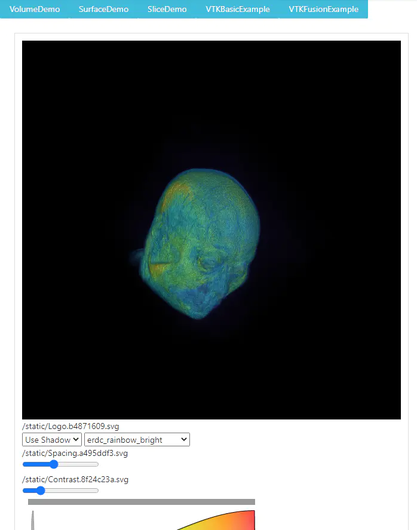

关于 Dicom Image Volume Rendering
如果想使用 vtk 来进行医学影像的体绘制的话，必须使用它们推荐的 .vti格式的文件
<!-- more -->
如果想用 .dcm 的文件直接进行渲染似乎是行不通的，于是我看到了一个git 上面的issue
https://github.com/Kitware/vtk-js/issues/678
官方说：

#### jourdain commented on 30 Mar 2018
To read a `vti` file you need to use that [reader](https://github.com/Kitware/vtk-js/tree/master/Sources/IO/XML/XMLImageDataReader) like [here](https://github.com/Kitware/vtk-js/blob/master/Examples/Applications/VolumeViewer/index.js#L66-L67)

The http reader use a different format which can be generated with that [script](https://github.com/Kitware/vtk-js/blob/master/Utilities/DataGenerator/vtk-data-converter.py).

But if you want to load DICOM, you should consider itk-js for loading your file natively and respect the orientation of the volume. [@thewtex](https://github.com/thewtex) can tell you more about it.

Also you can see DICOM loading using itk-js and vtk-js here with [ParaView Glance](https://kitware.github.io/pv-web-viewer/).

#### thewtex commented on 3 Apr 2018
Yes, as [@jourdain](https://github.com/jourdain) mentioned, we can load the DICOM images directly via [itk.js](https://insightsoftwareconsortium.github.io/itk-js/).

To load a multi-frame DICOM file (the entire volume is in one file), use [itk/readImageFile](https://insightsoftwareconsortium.github.io/itk-js/api/browser.html). To load a DICOM file series, use [itk/readImageDICOMFileSeries](https://insightsoftwareconsortium.github.io/itk-js/api/browser.html#readImageDICOMFileSeries-fileList-gt-itk-Image). Both of these are enabled in [this reference application](https://kitware.github.io/itk-vtk-image-viewer/).

### 简单来说
意思是说，如果想渲染 DICOM格式的文件，可以使用itk-js来实现：
这个库的地址是：
https://github.com/InsightSoftwareConsortium/itk-js

### 依然拷贝它的源码进行简单的测试
同样没有 yarn.lock，用npm install 进行安装
但是这个项目根本没有运行测试服务器的地方，所以装了也没啥用....
只能进入example 来看看示例代码了

itk的示例代码基本没有什么内容，但是他的文档至少把API给整理出来了。

我们可以看到有2个重要的API对处理DICOM数据十分重要：

### 1. 关键API : readImageFile(webWorker, file) -> { webWorker, image }
Read an image from a File.
这个API可以处理单个的DICOM数据

### 2.关键API : readImageDICOMFileSeries(fileList, singleSortedSeries=false) -> { image, webWorkerPool }
Read an image from a series of DICOM File‘s stored in an Array or FileList.
If the files are known to be from a single, sorted series, the last argument can be set to true for performance.
The used webWorkerPool is returned to enable resource cleanup, if required.
这个API可以处理一个series中的DICOM数据

后来又参考了很多 thewtex 给出的示例代码，花了很长的时间...

### 干脆就直接给出实现读取多个DICOM数据的流程:

#### (0) 巨坑！！首先需要配置webpack的环境
如果是使用了umi，请在config下加入新的copy配置参数：
提示：umi里面集成了 CopyPlugin ，如果利用 chainWebpack 来配置 CopyPlugin 的话，可能会覆盖掉它自己生成的配置，导致Public目录失效，坑！！！
```javascript
 copy: [
    // 设置要复制到输出目录的文件或文件夹
    {
      from: path.join('node_modules', 'itk', 'WebWorkers'),
      to: path.join('itk', 'WebWorkers'),
    },
    {
      from: path.join('node_modules', 'itk', 'ImageIOs'),
      to: path.join('itk', 'ImageIOs'),
    },
    {
      from: path.join('node_modules', 'itk', 'MeshIOs'),
      to: path.join('itk', 'MeshIOs'),
    },
    {
      from: path.join('node_modules', 'itk', 'PolyDataIOs'),
      to: path.join('itk', 'PolyDataIOs'),
    },
  ],
```
如果是正常的webpack，请参考官方示例下的webpack
```javascript
  plugins: [
    new CopyPlugin([
      {
        from: path.join(__dirname, 'node_modules', 'itk', 'WebWorkers'),
        to: path.join(__dirname, 'dist', 'itk', 'WebWorkers')
      },
      {
        from: path.join(__dirname, 'node_modules', 'itk', 'ImageIOs'),
        to: path.join(__dirname, 'dist', 'itk', 'ImageIOs')
      },
      {
        from: path.join(__dirname, 'node_modules', 'itk', 'PolyDataIOs'),
        to: path.join(__dirname, 'dist', 'itk', 'PolyDataIOs')
      },
      {
        from: path.join(__dirname, 'node_modules', 'itk', 'MeshIOs'),
        to: path.join(__dirname, 'dist', 'itk', 'MeshIOs')
      }
    ])
  ],
```

#### (1) 首先需要发网络请求

```javascript
await axios
      .get(
        'http://{DICOM_IP}/series/bfd34afd-f97a9f7c-c0551428-93a0c48a-0285c8ce?_=1624179883017',
      )
      .then((response) => {
        const { Instances } = response.data;
        for (const index in Instances) {
          files_paths.push(`http://{DICOM_IP}/instances/${Instances[index]}/file`);
        }
      });
    const fetchFiles = files_paths.map((file_path, index) => {
      const path = file_path;
      return axios.get(path, { responseType: 'blob' }).then((response) => {
        const jsFile = new File([response.data], `${index}.dcm`); // `${index}.dcm` ` file_path.split('/').slice(-1)[0]`
        return jsFile;
      });
    });
```
这里处理一组DICOM，首先获取所以DICOM文件的地址，然后生产了一组读取DCOM文件的异步方法。
这里从URL中获取，你也可以从本地来获取文件列表。
反正，需要获取到一个 文件的列表

#### (2) 转换图片数据
```javascript
Promise.all(fetchFiles).then((files) => {
      readImageDICOMFileSeries(files).then(({ webWorker, image }) => {
        // webWorker.terminate();
        // printImage(image);
        const imageData = vtkITKHelper.convertItkToVtkImage(image);
      });
    });
  };
```
这一步比较简单，直接调用方法对生成的图片列表执行ITK的方法
注意：ITK的方法进行了更新，只需要传入一个参数，如果参考老的代码会发生错误（坑！！
然后将itk image 格式再转换成 vtk 的image data，这里是VTK 里面一个方法做的事情，叫 ITKHelper

#### (3) 坑中坑！利用VTK渲染 imageData

```javascript
        const view3d = document.getElementById('view3d');
        const fullScreenRenderer = vtkFullScreenRenderWindow.newInstance({
          rootContainer: view3d,
          containerStyle: {
            height: '100%',
            overflow: 'hidden',
          },
          background: [0, 0, 0],
        });
        const renderer = fullScreenRenderer.getRenderer();
        const renderWindow = fullScreenRenderer.getRenderWindow();
        renderWindow.getInteractor().setDesiredUpdateRate(15);

        const source = imageData;

        // Pipeline handling
        actor.setMapper(mapper);
        mapper.setInputData(source);
        // mapper.setSampleDistance(0.7);

        const sampleDistance =
          0.7 *
          Math.sqrt(
            source
              .getSpacing()
              .map((v) => v * v)
              .reduce((a, b) => a + b, 0),
          );
        mapper.setSampleDistance(sampleDistance);

        renderer.addActor(actor);

        const lookupTable = vtkColorTransferFunction.newInstance();
        const piecewiseFunction = vtkPiecewiseFunction.newInstance();

        // create color and opacity transfer functions
        // 加了UI之后 这里的设置其实可以删除
        lookupTable.addRGBPoint(200.0, 0.4, 0.2, 0.0);
        lookupTable.addRGBPoint(2000.0, 1.0, 1.0, 1.0);

        piecewiseFunction.addPoint(200.0, 0.0);
        piecewiseFunction.addPoint(1200.0, 0.5);
        piecewiseFunction.addPoint(3000.0, 0.8);

        actor.getProperty().setRGBTransferFunction(0, lookupTable);
        actor.getProperty().setScalarOpacity(0, piecewiseFunction);

        actor.getProperty().setScalarOpacityUnitDistance(0, 4.5);
        actor.getProperty().setInterpolationTypeToLinear();
        actor.getProperty().setUseGradientOpacity(0, 1);
        actor.getProperty().setGradientOpacityMinimumValue(0, 15);
        actor.getProperty().setGradientOpacityMinimumOpacity(0, 0.0);
        actor.getProperty().setGradientOpacityMaximumValue(0, 100);
        actor.getProperty().setGradientOpacityMaximumOpacity(0, 1.0);
        actor.getProperty().setShade(1);
        actor.getProperty().setAmbient(0.2);
        actor.getProperty().setDiffuse(0.7);
        actor.getProperty().setSpecular(0.3);
        actor.getProperty().setSpecularPower(8.0);

        // Control UI
        const controllerWidget = vtkVolumeController.newInstance({
          size: [400, 150],
          rescaleColorMap: true,
        });
        controllerWidget.setContainer(view3d);
        controllerWidget.setupContent(renderWindow, actor, true);

        fullScreenRenderer.setResizeCallback(({ width, height }) => {
          // 2px padding + 2x1px boder + 5px edge = 14
          if (width > 414) {
            controllerWidget.setSize(400, 150);
          } else {
            controllerWidget.setSize(width - 14, 150);
          }
          controllerWidget.render();
          fpsMonitor.update();
        });

        // First render
        renderer.resetCamera();
        renderWindow.render();
```
网上大多数代码就给出了如何实现从DICOM数据 =》vtk image data 的转换，后续如何进行渲染很难找到例子。
官方的例子都惦记着他那个.vti格式文件的渲染，所以他直接就写一个 Reader 来进行文件读取了，没有直接拿image data进行渲染的。
我一开始尝试用  [React-vtk-js](https://github.com/Kitware/react-vtk-js) 这个库进行渲染，但是估计是不行，它也需要一个Reader进行配合，可能才能进行渲染。
无赖之下，还是只能参考 [itk-vtk-viewer](https://github.com/Kitware/itk-vtk-viewer) 这个实现，但是这个代码迭代的版本的太多，最新的代码结构太复杂，我只好从头来看，于是我尝试了很多旧版本的代码，但是始终都是黑屏的，也没报错，就是渲染不出3D的体素数据，我真的哭死。
我发现这个 itk-vtk-viewer 这个库一开始用了一些vtk比较原始的实现方法，似乎从 4.0开始，后面就用了 vtk 里面代理的方法进行实现，我也把代码抄了一下，但是始终就是黑屏，真的哭死...
第二天，我发现vtk的示例里面有一个 volume的app示例代码，我也抄了一下，但是依旧是渲染不出来，要吐了。关键它也不报错，我不知道问题是出在什么地方，我不知道是我数据出问题了，还是渲染出问题了。
最后我又偷了一个volume 的代码，我发现终于渲染出来了！问题就是好像是出在 **lookupTable** 和 **piecewiseFunction** 的设置上面，如果没有设置它们可能就是渲染不出来影像。于是一个很坑的地方出现了，我之前调试代码的时候，一直没有把UI这个东西加上，我以为不会对结果造成影像，于是**lookupTable** 和 **piecewiseFunction** 的参数，我也学示例代码里面写，把它们留白。但是实际上如果加了 **UI**,就会自动设置它们的参数，坑！！！

### 最后渲染结果：


最后由于loader可能还是有问题，所以UI界面不能正常展示，但是基础的功能有了。


### TODO...
这次被这个问题坑了很久，感觉还是对VTKJS的渲染不太熟悉
后续还是得熟悉一下 VTKJS 的代码，把现在的代码结构改成 VTKJS代理的那个实现方式...

