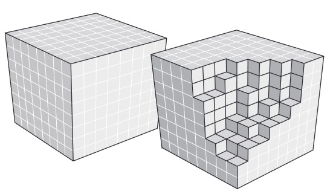

因为项目需要，现在要在web上实现一个体绘制（Volume Rendering）

本文的内容将会基于github项目: https://github.com/lebarba/WebGLVolumeRendering

多数内容翻译自文档 : http://www.lebarba.com/

<!-- more -->

## 📘什么是体绘制(Volume Rendering)?

​	与传统的渲染不同，使用三角形(triangles)来显示3D图形，体渲染使用其他方法，如 **体素光线投射算法(Volume Ray Casting)** 。这种基于图像的方法渲染一个3D标量场（scalar field）到一个2D图像通过沿着3D体素来投射光线（看不懂...）。我们在屏幕上看到的每一个像素是射线通过立方体并以一定的间隔从体素中获得强度样本的结果。

​	但是我们如何投射射线呢?

​	一个简单的方法是使用大小为(1,1,1)3D网格立方体，并且渲染正面和背面(启用和禁用背面剔除)在两个不同的渲染通道。

​	对于屏幕中生成的每一个立方体片段，我们可以创建一个射线，从立方体的正面开始，在背面结束。有了光线的起始点和结束点，我们就可以开始以固定的间隔对体素进行采样，以生成生成的片段颜色。



标量场 (scalar field) 以体素表示，这个体素包含每个(x,y,z)位置上的强度值（intensity ）


## 💙一步一步在WebGL中实现

在本节中，我们将解释使用WebGL和ThreeJS实现体绘制的实现步骤。

（根据项目的实际情况，对于原文中的步骤我会进行一些修改，并且实现方式为**React + ThreeJs**）

### ①第一步:准备数据

​	**原始文件 Raw files**（后文都叫Raw fIle) 是非常简单的文件，只包含体素强度，它们没有头部（head）或元数据（metadata），它们通常是一个8bit 或者 16bit 的强度值，每个体素以X, Y和Z的顺序排列。

​	在OpenGL或DirectX中，我们将能够在3D纹理中加载所有这些数据。但由于WebGL目前不支持存储或采样3D纹理，我们必须以一种可用于2D纹理的方式存储它（实际上现在好像可以了）。出于这个原因，我们可以存储一个带有Z切片的png图像文件，从而生成2D切片的拼接图。文章作者的开发了一个包含源代码的极其简单的转换器工具。该工具使用原始文件并生成一个png图像的拼接，在alpha通道中编码每个体素的强度(尽管理想的情况是将png存储为A8格式，只是为了节省一些空间)。

​	一旦png文件作为2D纹理加载到内存中，我们可以使用我们自己的自定义sampleAs3DTexture函数将其作为3D纹理进行采样。


### ②第二步:第一个渲染通道

​	在第二步，我们打算生成很多片段，作为射线的终点。所以对于第一个渲染通道，不绘制背面的颜色，我们将片段的World-Space位置存储在渲染纹理中，作为RGB片段颜色中的x、y、z坐标值(这里RGB被编码为浮点值)。

​	注意worldSpaceCoords是如何用于存储立方体背面位置的世界空间位置的。


**前端代码（部分）**

```javascript
const materialFirstPass = new THREE.ShaderMaterial({
    vertexShader: vertexShaderFirstPass,
    fragmentShader: fragmentShaderFirstPass,
    // 定义将要渲染哪一面 - 正面，背面或两者
    // BackSide，FrontSide，DoubleSide
    side: THREE.BackSide,
});
const boxGeometry = new THREE.BoxGeometry(1.0, 1.0, 1.0);
const meshFirstPass = new THREE.Mesh(boxGeometry, materialFirstPass);
scene.add(meshFirstPass);
```


**顶点着色器：**

```glsl
varying vec3 worldSpaceCoords;

void main()
{
    //Set the world space coordinates of the back faces vertices as output.
    worldSpaceCoords = position + vec3(0.5, 0.5, 0.5); //move it from [-0.5;0.5] to [0,1]
    gl_Position = projectionMatrix * modelViewMatrix * vec4( position, 1.0 );
}
```


**片段着色器**

```glsl
varying vec3 worldSpaceCoords;

void main()
{
    //The fragment's world space coordinates as fragment output.
    gl_FragColor = vec4( worldSpaceCoords.x , worldSpaceCoords.y, worldSpaceCoords.z, 1 );
}
```

**注解：**

**varying变量** 是vertex和fragment shader之间做数据传递用的。

**position** 哪里来的？内置的变量(uniforms)和属性 包括：

```glsl
// default vertex attributes provided by Geometry and BufferGeometry
attribute vec3 position;
attribute vec3 normal;
attribute vec2 uv;
```


**渲染结果**


​																			左边是 back side  右边是 back side


#### 使用 WebGLRenderTarget 建立缓冲

文档：

https://threejs.org/docs/index.html?q=WebGLRenderTarget#api/zh/renderers/WebGLRenderTarget

render target是一个缓冲，就是在这个缓冲中，显卡为正在后台渲染的场景绘制像素。 它用于不同的效果，例如用于在一个图像显示在屏幕上之前先做一些处理。

```javascript
// 使用NearestFilter来消除插值.  在 cube 阶段, 生成世界坐标插值
// 将在片段着色器中产生虚假的射线方向，从而产生外来的颜色。
const rtTexture = new THREE.WebGLRenderTarget(width, height, {
    minFilter: THREE.NearestFilter,
    magFilter: THREE.NearestFilter,
    wrapS: THREE.ClampToEdgeWrapping,
    wrapT: THREE.ClampToEdgeWrapping,
    // format: THREE.RGBFormat,
    type: THREE.FloatType,
    generateMipmaps: false,
});
```

**参数详解：**

**width** - renderTarget的宽度
**height** - renderTarget的高度

🤍options - (可选)一个保存着自动生成的目标纹理的纹理参数以及表示是否使用深度缓存/模板缓存的布尔值的对象 以下是一些合法选项：

**magFilter** - 默认是LinearFilter. **放大滤镜**
**minFilter** - 默认是LinearFilter. **缩小滤镜**

这2个参数代表纹理的放大和缩小，这里使用 THREE.NearestFilter

**wrapS** - 默认是ClampToEdgeWrapping.  **包裹模式**
**wrapT** - 默认是ClampToEdgeWrapping. **包裹模式**

使用RepeatWrapping，纹理将简单地重复到无穷大。

ClampToEdgeWrapping是默认值，纹理中的最后一个像素将延伸到网格的边缘。

使用MirroredRepeatWrapping， 纹理将重复到无穷大，在每次重复时将进行镜像。

**format** - 默认是RGBAFormat. **纹理的格式**  目前来看，好像必须设置成RGBA的格式，设置成别的格式会报warning？

**type** - 默认是UnsignedByteType. 用于纹理的type属性，这些属性必须与正确的格式相对应。

**generateMipmaps** - 默认是**false**.  **是否生成 Mipmaps**


#### 进行渲染

```javascript
// Render first pass and store the world space coords of the back face fragments into the texture.
renderer.setRenderTarget(rtTexture);
renderer.render(sceneFirstPass, camera);
renderer.setRenderTarget(null);
```

**使用函数：**

**.setRenderTarget **

**( renderTarget : WebGLRenderTarget, activeCubeFace : Integer, activeMipmapLevel : Integer ) : null**

renderTarget -- 需要被激活的renderTarget(可选)。若此参数为空，则将canvas设置成活跃render target。
activeCubeFace -- Specifies the active cube side (PX 0, NX 1, PY 2, NY 3, PZ 4, NZ 5) of WebGLCubeRenderTarget (optional).
activeMipmapLevel -- Specifies the active mipmap level (optional).

该方法设置活跃rendertarget。


### ③第三步:第二个渲染通道

这个渲染通道实际上是执行体积光线投射的，它从绘制立方体的正面开始，正面的每个点都是射线的起点。

顶点着色器创建两个输出:**投影坐标(片段的2D屏幕坐标)(projectedCoords)** 和 **世界空间坐标 (worldSpaceCoords)** 。

**世界空间坐标**将被用作射线起点，而**投影坐标**将被用于采样存储立方体背面位置的纹理。

**vertexShaderSecondPass.vert**

```glsl
varying vec3 worldSpaceCoords;
varying vec4 projectedCoords;

void main()
{
    worldSpaceCoords = (modelMatrix * vec4(position + vec3(0.5, 0.5,0.5), 1.0 )).xyz;
    gl_Position = projectionMatrix *  modelViewMatrix * vec4( position, 1.0 );
    projectedCoords =  projectionMatrix * modelViewMatrix * vec4( position, 1.0 );
}
```

**注解**

这里 gl_Position = projectedCoords 都是片段的2D屏幕坐标

而 worldSpaceCoords 是世界空间坐标，范围是 （0 -1）的区间


这个片段着色器的第二个渲染通道有点复杂，所以我们要慢慢分析这个部分。


​	在这个例子中，射线 R0 到 R4 是从立方体正面的片段位置投射的 （f0 到 f4 ) ，结束在立方体背面的位置(I0到I4)


#### 得到射线的向量

基于上一步的位置，我们对纹理进行采样，以获得背面片段的世界空间位置。

注意我们如何通过除以W将投影坐标转换为NDC(标准化设备坐标)，然后如何将其转换为[0;1]范围，以便将其用作UV坐标。当我们对之前渲染通道中生成的2D纹理采样时，就得到了射线的结束位置。

**fragmentShaderSecondPass.frag**

```glsl
// 将坐标从 vert shader 中传入
varying vec3 worldSpaceCoords;
varying vec4 projectedCoords;

uniform sampler2D tex;

void main( void ) {
   //转换屏幕空间坐标从 [-1;1] 到 [0;1]
    vec2 texc = vec2(((projectedCoords.x / projectedCoords.w) + 1.0 ) / 2.0, ((projectedCoords.y / projectedCoords.w) + 1.0 ) / 2.0 );
    //后面的位置 是 存储在材质中的世界空间坐标
    vec3 backPos = texture(tex, texc).xyz;
    //前面的位置 是 世界空间坐标
    vec3 frontPos = worldSpaceCoords;
   //从前面的位置 到 后面的位置 的向量
    vec3 dir = backPos - frontPos;
    // 射线长度
    float rayLength = length(dir);
	// 测试用...
    gl_FragColor = vec4( backPos.rgb, 1.0 );
}
```

然后开启正面着色的话，就会在屏幕上绘制立方体后面的位置的坐标信息。


#### 设置射线

有了front和back位置，我们现在可以创建一个从frontPos开始并以backPos结束的射线。  

```glsl
// step2
// 计算步长
float delta = 1.0 / steps;

// 计算长度
vec3 deltaDirection = normalize(dir) * delta;
float deltaDirectionLength = length(deltaDirection);

// 射线从 立方体前面位置 射入
vec3 currentPosition = frontPos;

// 设置一个颜色的累积器
vec4 accumulatedColor = vec4(0.0);

// 设置一个 Alpha 的累积器
float accumulatedAlpha = 0.0;

// 射线传播了多长的距离
float accumulatedLength = 0.0;

vec4 colorSample;
float alphaSample;
```


#### 射线发射

一旦射线被设置好，我们的射线将从起始位置，推进射线的当前位置到 **dir** 。

在每一步中，我们对纹理进行采样，以寻找体素强度。需要注意的是，体素只包含强度值，因此到目前为止它们还没有关于颜色的任何信息。赋予每个体素颜色的是 **变换函数 **   **transform function** 。可以看看 **sampleAs3DTexture** 函数代码，看看转换函数是如何工作的。

在我们有了由sampleAs3DTexture给出的体素颜色后，它会被 **alphaCorrection** 参数校正。你可以在线调整这个值，看看有什么不同的结果。

每次迭代的重要部分是实际的颜色构成，在这里，**accumulatedColor** 值被添加到之前存储的基于alpha值的值之上。我们还保存了一个**alphaAccumulator**，它将让我们知道何时停止射线的前进。

迭代会一直进行，直到满足以下三个条件之一:

- 射线走过的距离达到了假定的射线长度。记住，射线是从startPos到endPos。
- 累计alpha值达到100%
- 迭代达到最大常数MAX_STEPS

最后，片段着色器返回被遍历的体素值的合成结果。


改变控制面板中的 **steps** ，如果你可以改变每条射线的最大迭代次数，你可能需要相应地调整 **alphaCorrection** 值。

