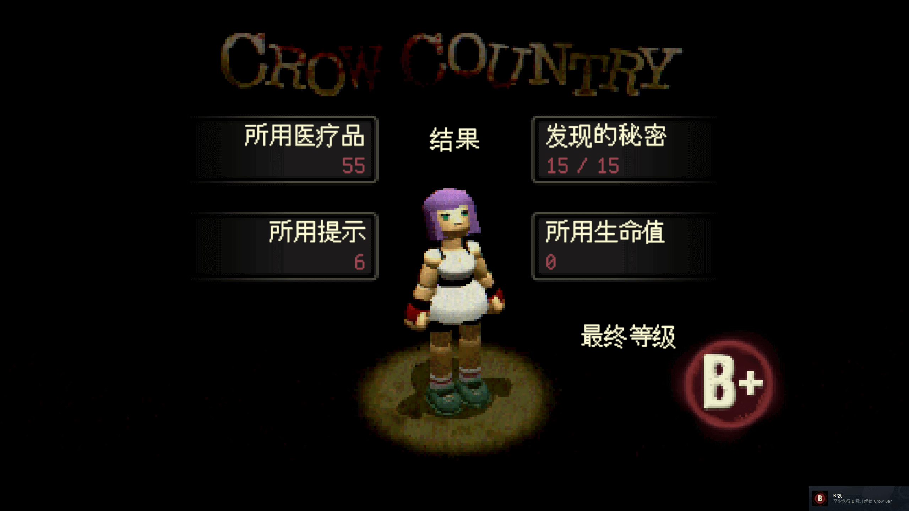
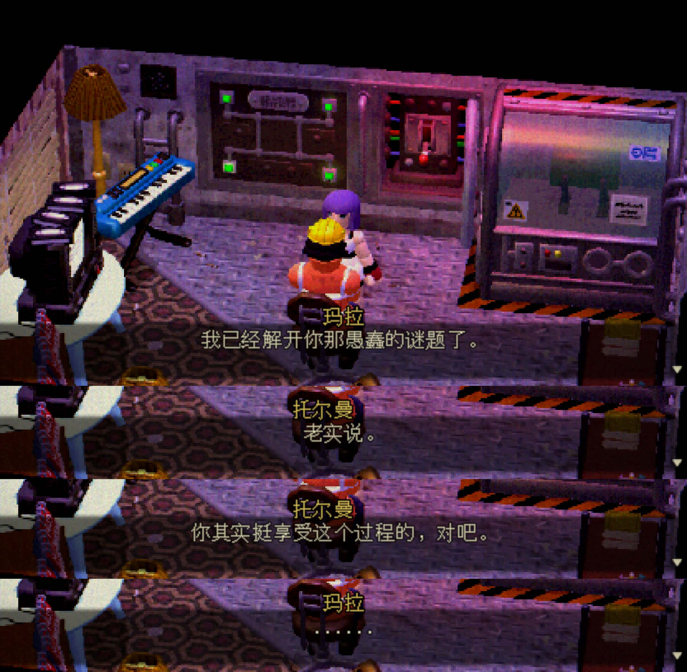
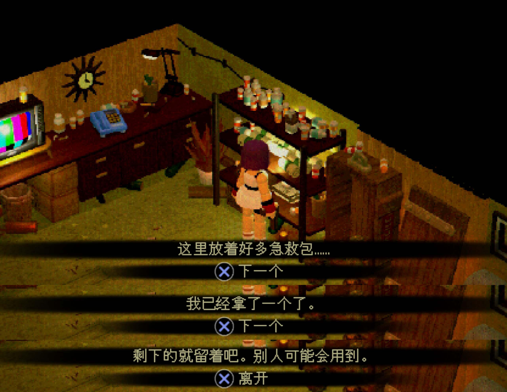
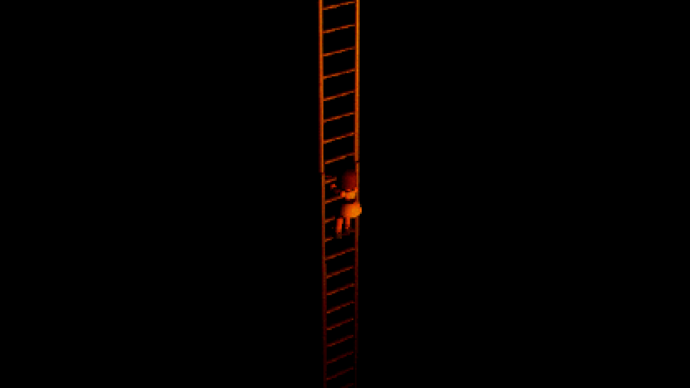
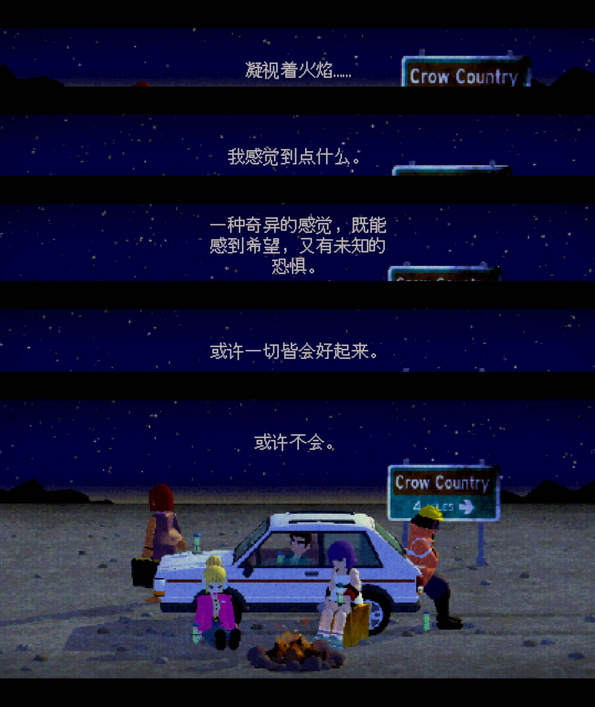

记录一些游戏通关后的感想
<!-- more -->

## 🔵 总结

**2026年2月14日通关记录：**

**个人评分： 7/10。**
		普通难度下通关时间在5个半小时左右，长度适中，难度比较简单，玩到后期物资很多。
		一部全面致敬老生化危机（指初代生化危机）的作品，游戏整体画风复古像ps1游戏，有一些设计又比较现代，比如允许使用摇杆切换视角，有一定动态难度设计。
		必须吐槽的是战斗方面很别扭，我使用的是ps4手柄来，人物瞄准时会切到人物视角的前方而不是镜头前面，这一点可能是为了适配老生化坦克式的移动和射击，但是由于游戏又引入现代化的设计（指允许玩家用遥感切换视角），导致非常别扭。玩惯了现代第三人称射击的新玩家肯定会玩的很难受，总结就是想复古但是又没彻底。
		其他的如解密方面大部分情况下都比较简单，只要玩家愿意认真阅读捡到的文档或手册，有部分谜题需要玩家的记忆力。剧情方面也是比较经典的（生化危机式？）的故事，调查员来到一个类似洋馆的地方，通关阅读文档把故事拼凑出来，有一个地下室，并且隐藏着不为人知的秘密。感觉整体而言无功无过。游戏在一些小细节上做的非常用心，比如游戏厅的答题游戏都是精心选择的。

## 🔵 记录一些有趣的细节

游戏里面一些比较有意思的对话一则：
可能含有 META 要素？挺有意思的

可恶，为什么不能多拿几个？明明有这么多！🥹

游戏中出现了超级长的爬梯子的场景，很明显在致敬合金装备3。

> 在《Metal Gear Solid 3》中，有一段极长的垂直梯子攀爬场景，主角 Snake 要在几乎没有操作变化的情况下持续向上爬很久。期间：
>
> - 画面几乎没有变化
> - 操作单调
> - 背景音乐《Snake Eater》的无伴奏版本缓缓响起
> - 时间被刻意拉长，形成一种“孤独 / 过渡 / 仪式感”
>
> 这一段因为反差强烈、情绪表达独特、节奏刻意拖长而成为游戏史上著名桥段，也经常被后来的游戏用来玩梗或致敬。

游戏的结尾，类似生化1和2代经历重重危机后逃出生天一样：

这里出现的一段话也是每次安全屋存档时会出现的一段话：

**凝视着火焰……**

**我感觉到点什么。**

**一种奇异的感觉，既能感到希望，又有未知的恐惧。**

**或许一切皆会好起来。**

**或许不会。**

> 1️⃣ “希望与恐惧并存”的主题总结
> 这段台词几乎是整部作品情绪的浓缩：
> 	• 火焰象征生存、文明、微弱的希望
> 	• 夜空与荒野象征未知与失控
> 	• 角色之间的距离感暗示创伤尚未消失
> 它没有给出“安全”的承诺，而是强调一种创伤之后的现实——
> 恐怖不会彻底消失，人也不会完全回到从前。
> 这是一种很典型的心理层面的恐怖收束，而不是剧情层面的“谜团解答式”收束。
>
> 2️⃣ 90年代PS1风格的“留白式结尾”
> 《Crow Country》本身在美术和叙事上都在致敬早期3D生存恐怖游戏，比如：
> 	• Resident Evil
> 	• Silent Hill
> 尤其像《Silent Hill》的某些结局——
> 逃出来了，但精神是否真正逃出来？不确定。
> 这种“或许会好起来，或许不会”的句式，本质是拒绝给玩家情绪确定性。
