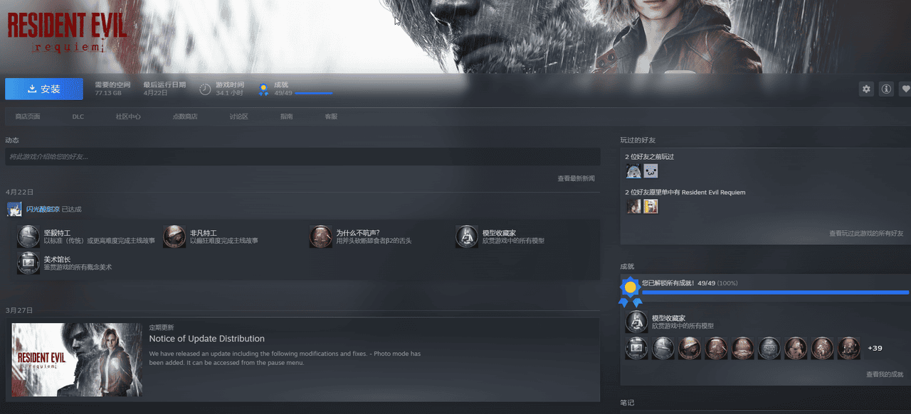
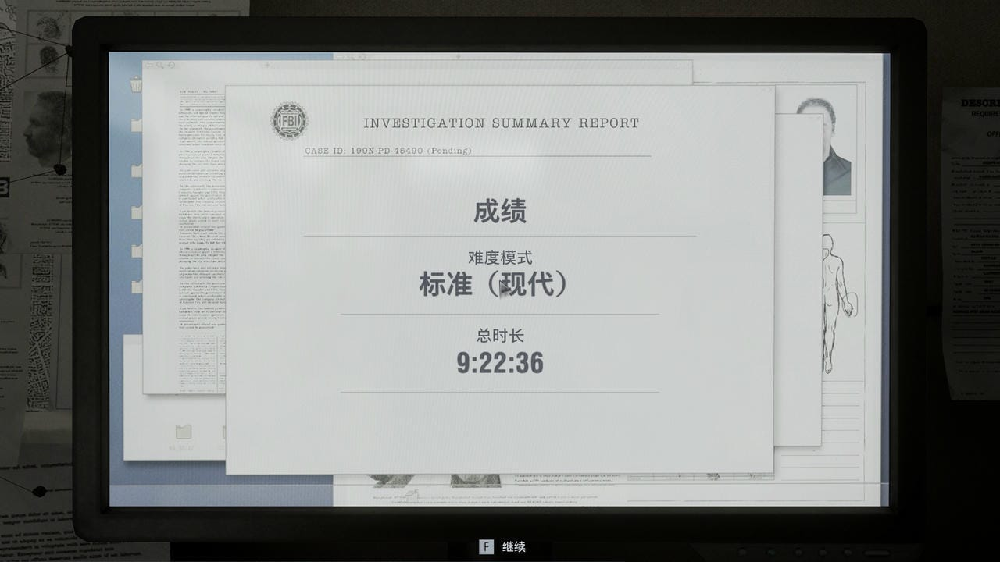
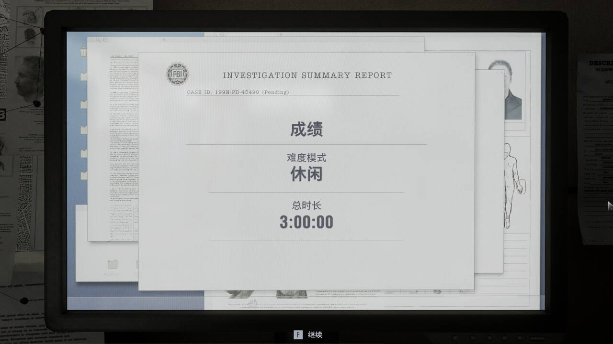
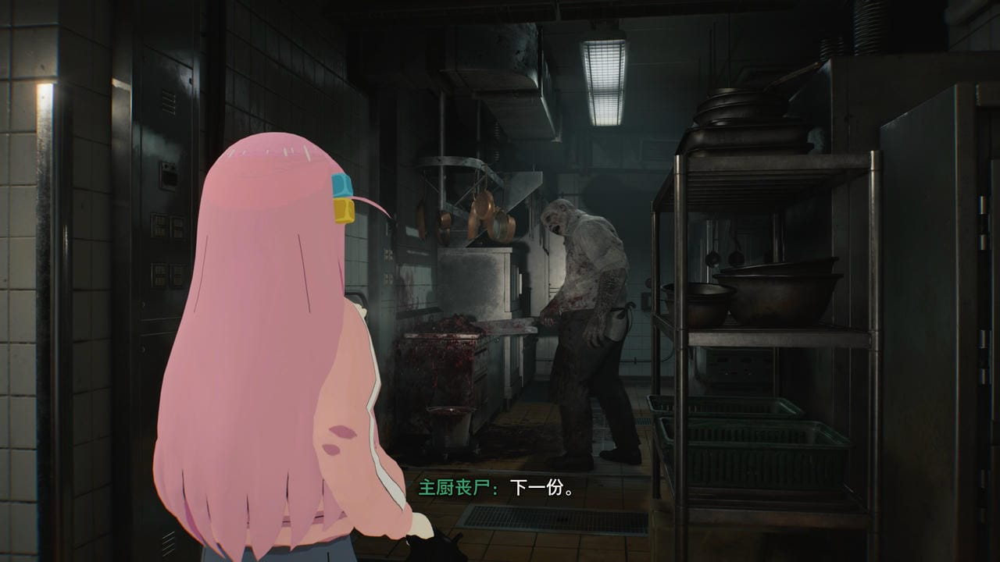
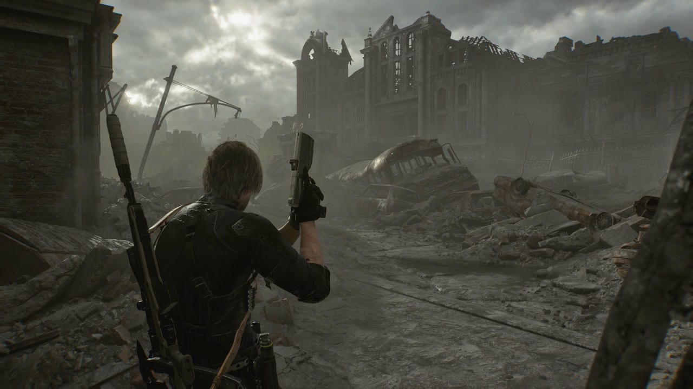
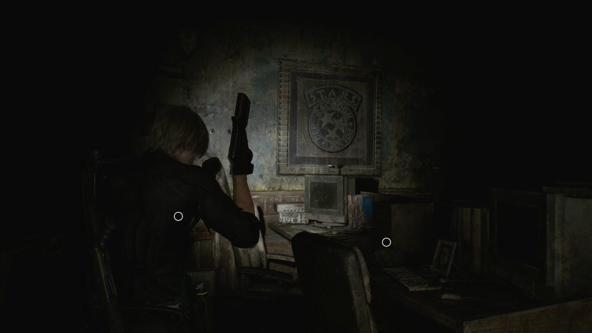

距离《生化危机9》发售至今，已经2月。

虽然刚出的时候我就通关了，但是由于懒，我最近才取得生化9的全成就，这里记录一下主要的游玩过程和吐槽。

<!-- more -->

2026年4月22日达成全成就记录：

## 🔵 简单评测

### 🔷 首先从游玩时间来说

作为一个线性游戏来说，生化危机系列经常为人诟病的是游戏时间较短，这一点在生化危机3重制版中最为严重，在生化4重制版中又有改善，为系列IP挽回了很多口碑。

本作在普通难度下初见通关时间在9小时左右，我初见通关用了9小时22分钟：

为了刷无限子弹等奖励，我又在休闲难度下速通游戏，这次只用了刚好3小时：

本作的游玩时长总体而言不算太短，但是又不能算长，和一些超级大作，比如最后生还者2相比，还是短了...

### 🔷 格蕾丝的部分

本作将生存恐怖与动作游戏进行了结合，采用了双主角的设计。格蕾丝的部分是传统的生化危机生存恐怖的游玩风格，而里昂的部分是加强版的生化4重制版的游玩风格，这样的设计引出了本作最大的问题，这个在后面总结的时候会说。

首先聊格蕾丝的部分：

格蕾丝篇章在一座的疗养院中展开，这部分给我感觉就是比较传统，它的体验有点类似生化7，生化2重制版，玩家又一次被放置在一个类“洋馆”的建筑，通过一系列的解密流程，需要凑齐3个像“图章”一样的东西，才能开启大门逃生。

在这个篇章中比较亮点的地方是本作中的丧尸有一些独特的设计，本作中的设定是丧尸会保留一些生前的行为模式，于是玩家就可以看到正在切肉的主厨丧尸，不断擦地的女工丧尸，爱唱歌的戏服丧尸，还有输液杆战神。

下面有一些截图是我在获得无限子弹后截的，不是初见了，所以打了一些奇怪的模组：

### 🔷 里昂的部分

里昂的关卡在被“核爆”（后面卡普空吃书变成温压弹）的浣熊市展开，画面风格是像电影生化危机3一样的废土风，对了本作的豪华版预购还奖励了电影生化3同款的衣服。

里昂的战斗部分完全就是加强版的生化4重制版里的里昂，里面给了里昂一把斧子，这个斧子被设计得过强了，虽然有耐久度的限制，但是玩家只需要拿出磨刀石磨一磨又能马上恢复到满耐久。

比较值得令人回味的部分是生化9中出现了荒废了后的浣熊市警察局，这一波是狠狠的卖了一波情怀了。

在浣熊市警察局中可以找到很多勾起新老玩家回忆的场景和物件，例如STARS在办公室里还能找到巴瑞留下的纸条，吉尔的警帽，瑞贝卡的医疗包等等...

### 🔷 剧情一直是短板

生化系的游戏剧情一直都是短板，这一点在本作上尤其凸显，很多地方都在吃书，部分设定经不起推敲，给人感觉重返浣熊市的桥段是先射箭再画靶，这一点网上已经有很多视频吐槽过了。

本作中有一个很像威斯克的角色，叫奇诺，但是这个角色太区了，最后居然连个BOSS战都没有。

### 🔷 总结
本作中不管是经典生存恐怖的格蕾丝篇章，还是战斗爽快的里昂篇章，单拿出来都不错，做到了线性游戏的第一梯队。但是正是由于本作把两种游玩风格缝合到一款游戏中，导致两个篇章的长度都不足，缺乏游玩深度，尤其是本作的里昂篇章和生化4重制版相比的成长性太少，所以我认为在卡普空经费有限的情况下把2款游戏的内容塞入一款游戏不是一个好主意。

**综合个人评分： 8.0/10.0 （值得游玩，但有明显缺陷）**

