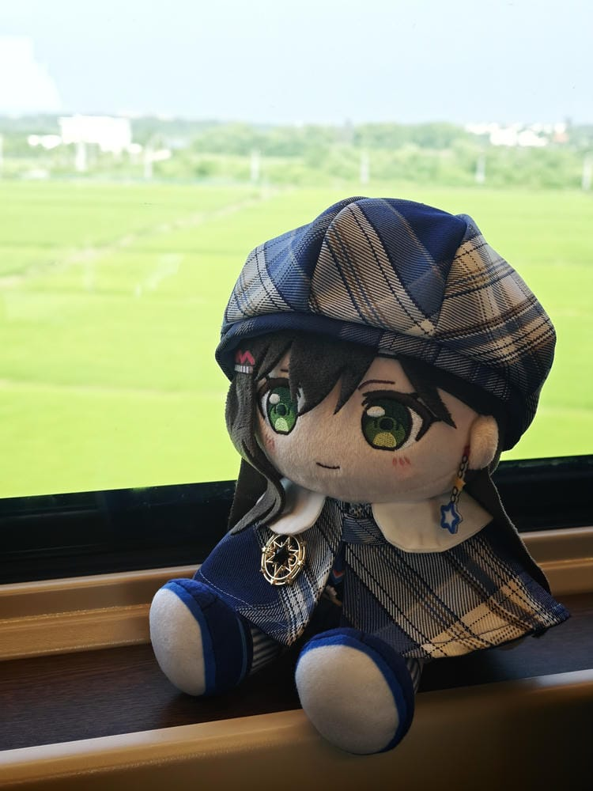

## 🔵 前言

以前，我出远门通常需要一个明确的理由，比如去年10月我去了上海的 MyGO!!!!! × Ave Mujica，因为想在上海梅奔看一次演出，更想看看我喜欢的偶像。

但由于中日关系交恶，后来我关注的日本艺人演出基本也没再有国内场，实在有些可惜。甚至到杭州 CP，今年的 BW 和 BML 几乎都禁了日漫 IP，BML 几乎完全变成了国产手游的演唱会，我也没有要去的想法了🥲。
<!-- more -->

今年上半年发生了不少事，工资没涨，反而在降，年终也被砍。从前看都不看就买的东西，现在可能需要经过“深思熟虑”才会下单了。

8月我有5天的高温假，加上前后2个周末总共9天的休息。之前和我高中同学 hamel 去喝酒的时候，曾经提过要利用假期去北京玩一下，毕竟作为首都，我还一次都没有去过。

虽然想好了要节省开支，但是9天的假期全部在家里“躺平”，而不去创造一些回忆，会不会有点太浪费了？所以，终于还是决定趁着高温假期间去北京旅游一趟，和 hamel 一起去。

其实这几天上班的时候总会想，到底是真的想出去旅行，去北京玩呢？还是刚好有个假期来了，如果不趁着连续的假期出去玩，后面就没这种机会了呢？

如果是后者的话，那所谓的休假，也没那么自由？上班的时候按部就班，休假又像大家一样按照“难得有长假就应该出去旅行”的规则生活。

这之间的区别究竟在哪里？

不过从一种被“安排”，到了另一种被“安排”，并不随心所欲。

想不明白，只是觉得不舒服。

也是因为这些原因，这次去北京玩尽量不会把行程安排得太满。想去的地方就去，不要起得太早，不想动了累了就多呆在酒店休息，至少这九天里，不需要像平时工作一样赶着完成什么，

就把这次旅行，当作一次年中的休整吧。

### 🔷 游记

#### 📅 8-8

由于前一天晚上我睡得比较晚，所以早上出发时人都晕晕的，不过幸好这次不像之前一样忘带东西。

到了武汉站后我和 hamel 碰面，hamel 不像我一样带着行李箱，而是拎着一个挺大的黑色旅行袋，背着双肩包，上身穿着好像是优衣库买的短袖衬衫，米白色底配着灰绿色的叶子，标准的度假打扮。

进了高铁站之后，居然碰到了我的两个领导！

我和他们坐同一班高铁去北京，不过他们是去北京出差的，不是去玩的。和领导简单打了招呼，聊了几句之后就分开了。

从武汉到北京的高铁有4个小时，高铁出发后，hamel 把租来的相机拿出来研究了一阵。我对相机的研究比较少，只是从包里把多惠棉花娃娃掏了出来，让他先拿这个练手。

虽然前面纠结过要不要出去玩，但给多惠酱准备新衣服的时候倒完全没有犹豫。我挑了套蓝色的新衣服，这个颜色很适合她：

12:30 的时候我们到达北京西站，这里离我们要住的酒店还有一段距离。

"怎么去酒店呢?坐地铁，还是说出租“

”要不就坐出租吧，反正两个人可以A钱，正好也可以感受一下北京出租车的价格“

因为我还是有点疲惫，所以还是想选择轻松一些的交通方式。

只是没想到这一趟出租真的很堵，我们差不多到下午1点半才到预定的酒店。出租车花费将近40多，体感是比武汉贵一些。

说起来这次出去玩我们定的是如家集团下的电竞酒店，这样晚上就有电脑玩了。

( 时间线:
◾ 12:30 到达 北京西站
◾ 13:40 到电竞酒店，办理入住
◾ 14:10 出发去天坛公园
◾ 14:40 到底天坛公园
◾ 17:30 逛完，出发去吃饭
◾ 18:00 吃鸿宾楼
◾ 19:00 吃完出发去 三里屯太古里
◾ 19:10 路过工人体育场，参观了一下
◾ 19:22 到 三里屯太古里 逛了一下，感觉有点累
)

#### 📅 8-9

八达岭长城

#### 📅 8-10

故宫博物院

天安门广场

颐和园

#### 📅 8-11

#### 📅 8-12

## 🔵 参考资料

