## 🔵 前言

以前，我出远门通常需要一个明确的理由，比如去年10月我去了上海的 MyGO!!!!! × Ave Mujica，因为想在上海梅奔看一次演出，更想看看我喜欢的偶像。

但由于中日关系交恶，后来我关注的日本艺人演出基本也没再有国内场，实在有些可惜。甚至到杭州 CP，今年的 BW 和 BML 几乎都禁了日漫 IP，BML 几乎完全变成了国产手游的演唱会，我也没有要去的想法了🥲。
<!-- more -->

今年上半年发生了不少事，工资没涨，反而在降，年终也被砍。从前看都不看就买的东西，现在可能需要经过“深思熟虑”才会下单了。

8月我有5天的高温假，加上前后2个周末总共9天的休息。之前和我高中同学 hamel 去喝酒的时候，曾经提过要利用假期去北京玩一下，毕竟作为首都，我还一次都没有去过。

虽然想好了要节省开支，但是9天的假期全部在家里“躺平”，而不去创造一些回忆，会不会有点太浪费了？所以，终于还是决定趁着高温假期间去北京旅游一趟，和 hamel 一起去。

其实这几天上班的时候总会想，到底是真的想出去旅行，去北京玩呢？还是刚好有个假期来了，如果不趁着连续的假期出去玩，后面就没这种机会了呢？

如果是后者的话，那所谓的休假，也没那么自由？上班的时候按部就班，休假又像大家一样按照“难得有长假就应该出去旅行”的规则生活。

这之间的区别究竟在哪里？

不过从一种被“安排”，到了另一种被“安排”，并不随心所欲。

想不明白，只是觉得不舒服。

也是因为这些原因，这次去北京玩尽量不会把行程安排得太满。想去的地方就去，不要起得太早，不想动了累了就多呆在酒店休息，至少这九天里，不需要像平时工作一样赶着完成什么。

就把这次旅行，当作一次年中的休整吧。

### 🔷 游记

#### 📅 8-8

由于前一天晚上我睡得比较晚，所以早上出发时人都晕晕的，不过幸好这次不像之前一样忘带东西。

到了武汉站后我和 hamel 碰面，hamel 不像我一样带着行李箱，而是拎着一个挺大的黑色旅行袋，背着双肩包，上身穿着好像是优衣库买的短袖衬衫，米白色底配着灰绿色的叶子，标准的度假打扮，似乎比我更早进入旅行状态。

进了高铁站之后，居然碰到了我的两个领导！他们和我坐同一班高铁去北京，只不过是去出差的，不是去玩的。

从武汉到北京的高铁有4个小时，高铁出发后，hamel 把租来的相机拿出来研究了一阵。我对相机的研究比较少，只是从包里把多惠棉花娃娃掏了出来，让他先拿这个练手。

虽然前面纠结过要不要出去玩，但给多惠酱准备新衣服的时候倒完全没有犹豫。我挑了套蓝色的新衣服，这个颜色很适合她：

12:30 的时候我们到达北京西站，这里离我们要住的酒店还有一段距离。

"怎么去酒店呢?坐地铁，还是说出租“

”要不就坐出租吧，反正两个人可以A钱，正好也可以感受一下北京出租车的价格“

因为我还是有点疲惫，所以还是想选择轻松一些的交通方式。只是没想到这一趟出租真的很堵，差不多到下午1点半才到预定的酒店。花费将近40多，体感是比武汉贵一些。

这次出去玩定的是如家集团下的电竞酒店，办理入住花了一点时间，我们没有做过多停留就离开了酒店，因为下午还打算去逛天坛公园。

大概两点半到了天坛公园。八月的北京已经很热了，不过体感居然还不如武汉难受，可能武汉在热这个方面还是太权威了吧🥵。还没进公园，入口前就已经排起了长队，大人带着放暑假的小孩，三三两两的大学生，还有举着手机拍照的游客挤在一起。直到站进这条队伍里，我才终于有了一点“真的出来旅游了”的实感。

去祈年殿的路上我们还顺便挂了一些小展馆，里面大多是和祭祀相关的器物、陈设，看得时候不算很认真，现在已经没有多少印象了。

参观祈年殿还要再检一次票。我和 hamel 买的都是套票，直接刷身份证就能进去，只是人实在很多，于是又排了一次队。

走近祈年殿后，感觉很难只用“漂亮”来形容它。蓝色的琉璃瓦、层层向上的圆形屋顶，还有那些繁复却整齐的纹样，都让我觉得它带着某种很强的“神性”，难怪古代这是皇帝祈福的地方。

我看把多惠从包里拿了出来，和祈年殿一起拍了张照片：

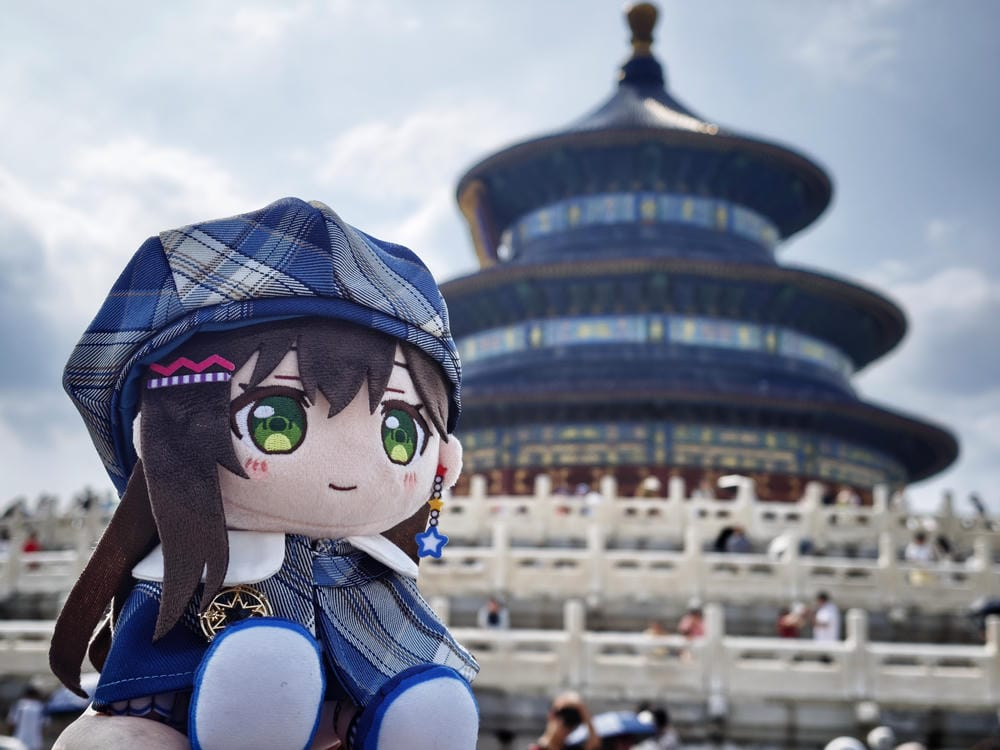

后面我们有去看了圜丘，回音壁，斋宫等地方，后面这些地方就不像祈年殿一样给我留下深刻印象了。

约17点半的时候，我们就逛完了，这个时间差不多要去吃饭了。hamel 说他有个认识的大学同学在北京工作，正好来北京可以聚一聚，我们就打车到了一个叫鸿宾楼的地方吃饭。

现在回想起来，鸿宾楼是我们这次在北京吃的最好吃的一餐，虽然价格很高，但是味道对得起它的价格。

等我们到鸿宾楼的时候，hamel 的同学已经帮我们占好位置，我看着他同学留着长发，还以为是女生，正面看才知道原来是长发男。

听他同学说，他最近才离职找了新工作，原来的公司听起来很不好。

我们没有吃很久，因为 hamel 同学晚上要去看诺兰的《奥德赛》，是19点半的电影，所以我们19点就分开了，晚上 hamel 说想去三里屯太古里逛一下。

路上我们路过了工人体育场，工人体育场是中超球队北京国安的主场，我在来北京之前就想过去打卡，如果我们周五晚上就到了的话，甚至还有机会看一场球赛。

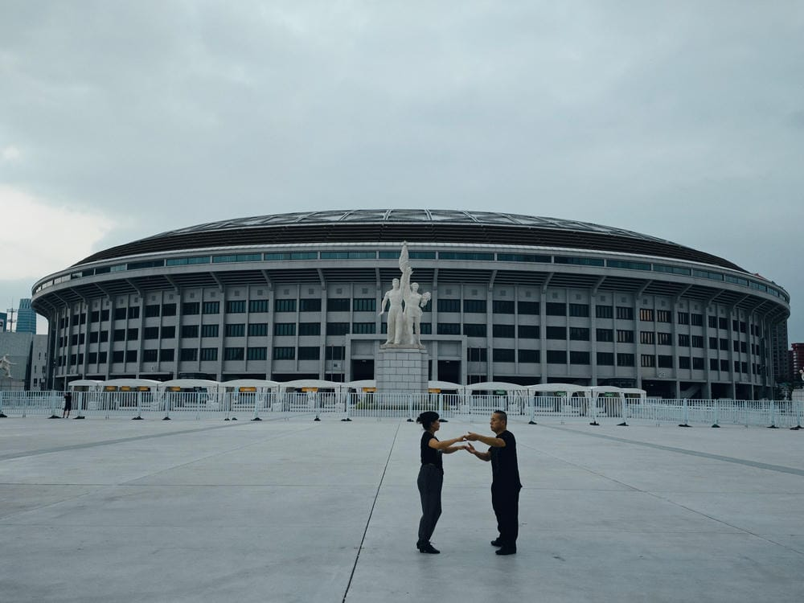

三里屯太古里就是一个大型的开放商业街，令我印象比较深的只有一个巨大的苹果店，这个在武汉倒是没见过这么大。如果要我形容的话三里屯太古里这个地方有点像武汉的奥特莱斯，只不过三里屯太古里卖的东西整体都比奥特莱斯贵上一个级别的样子。

我们没有逛太久就有点走不动了，腿子酸了，然后就打车回电竞酒店了。

回到电竞酒店后，hamel 晚上在打街霸6，他把他的手柄都带来了，可惜他不早点说带了手柄，要不然我也把手柄带来一起玩了。我就在旁边看最近的新番 《感谢对战大小姐才不玩格斗游戏》，刚好也是讲街霸6的，我感觉挺有意思就怕了照片。

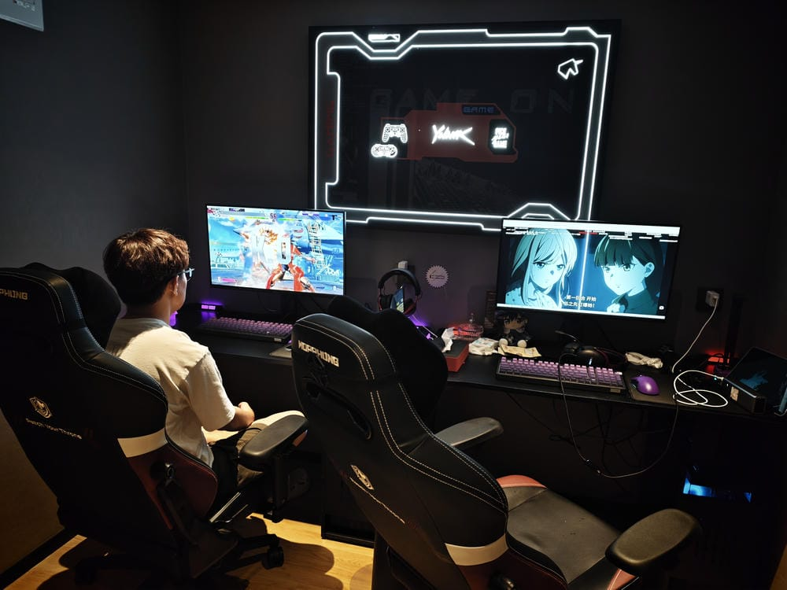

第一天晚上我记得睡得很糟，可能是因为我睡觉择床吧，在床上翻来覆去睡不着，几乎熬到2，3点才睡着。

#### 📅 8-9

北京旅行的第二天，今天就是重头戏了，我们安排今天去天安门，故宫和景山公园玩一趟。

说到北京旅行，故宫几乎是所有旅行攻略都必去的地方，所以为了防止抢不到票，故宫的票我还是在闲鱼上找代抢帮我们抢到的票，相比原票价还多付35块钱。

我们坐地铁去天安门，北京的地铁站给我留下了很深刻的印象，可能因为北京有些地铁站建的很早吧，所以风格很复古，看起来有点苏式的感觉，这一点和武汉很不一样。我还特意拍了照片留恋，然后稍微P了一下，把行人都去掉，看起来又很有“后室”的感觉，非常有趣。

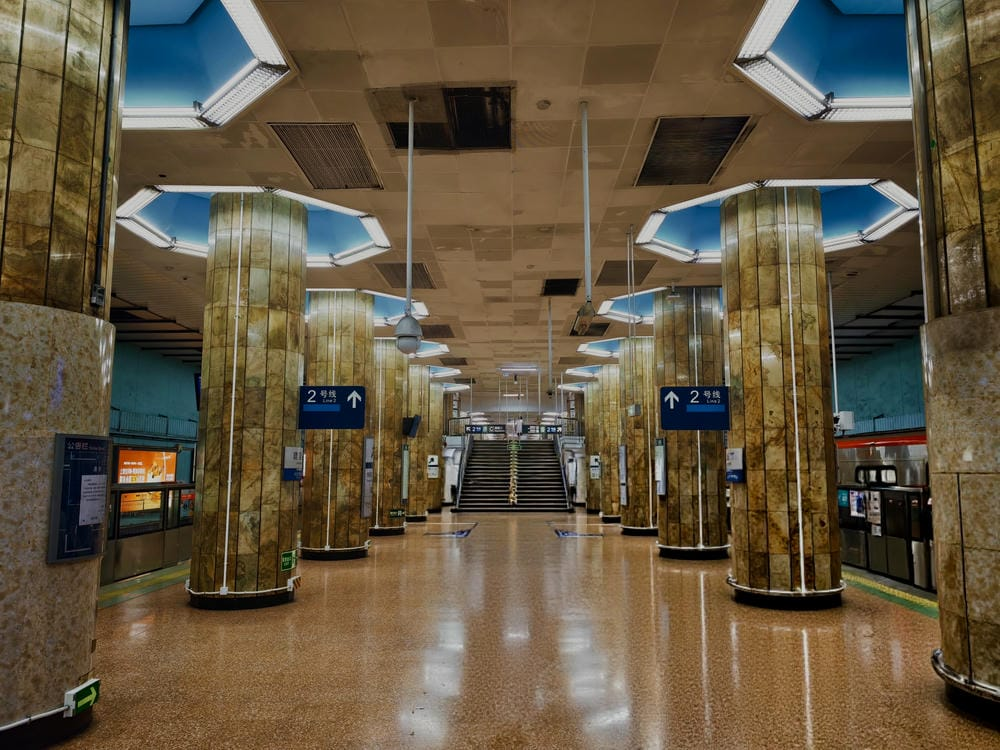

进天安门前的安检非常严格，这是我之前没考虑到的，我医疗包里面的打火机，还有书包小口袋里面打火机都被安检人员查出来丢掉了。不过总体而言有惊无险，我们还是顺利进了天安门广场。

天安门对于绝大多数国人来说，是一个从小到大“见过”无数次的地方，但是真正亲眼看到对我来说是第一次。

广场前聚集了无数的游客，大人带着小孩，举导游旗的人，外国人，还有很多一看就是便衣警察的人，托这些便衣警察的福，无时无刻不在提醒这个地方的严肃性。

hamel 找了一个游客帮我拍了一张合影，这也是我们这次北京旅行拍的唯一一张合影。

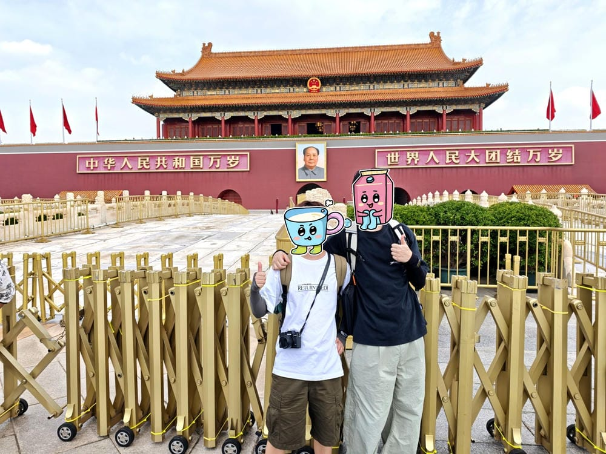

由于时常有便衣警察，或工作人员在催促游客快点走，我们没有在天安门广场做过多停留。

从天安门进去后，经过几个很大的门之后，我对于记这些地点不是很擅长，只记得经过的最宏伟的一个是午门，然后我们就到故宫博物馆了。

第一个令我印象深刻的建筑是太和殿，它也是中轴线最大的一个建筑，太和殿据说是用来举行各种大型典礼的场所，如果第一次来很可能会以为太和殿是皇帝上朝的地方。

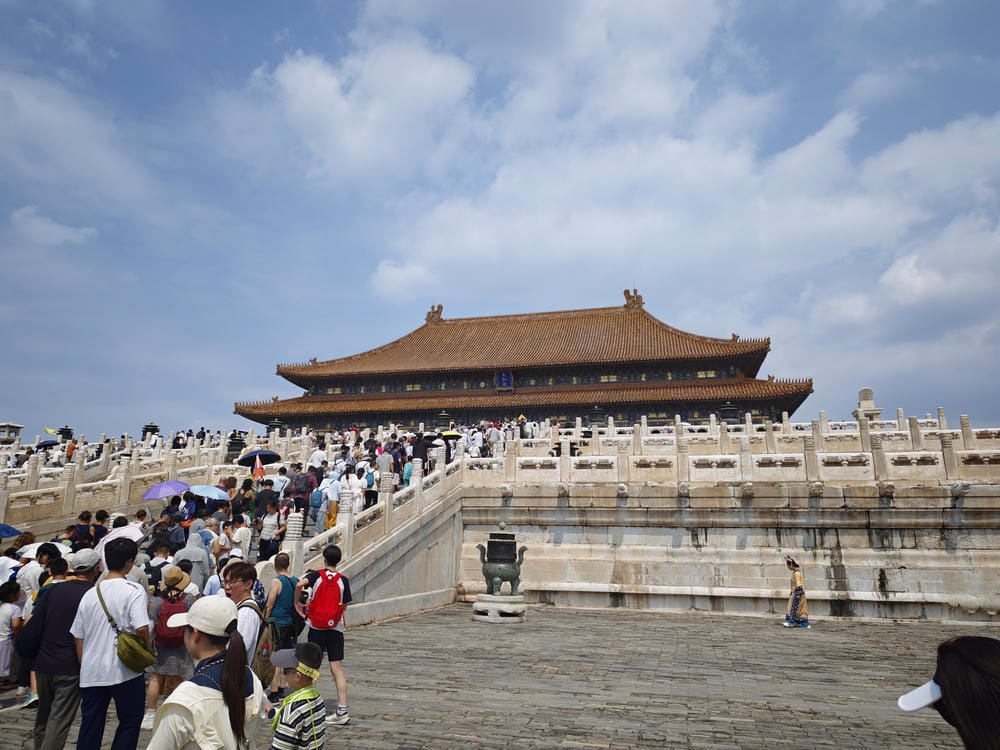

之后我们还参观了很多地方，比如军机处，故宫珍宝馆，养心殿，乾清宫等等，如果要展开来讲的感觉太麻烦了，我就分析一些另外印象比较深刻的吧。

首先是我隔着窗户参观了慈溪的寝宫，以现在的标准来看感觉挺小的，可能以那个年代来说非常豪华了？

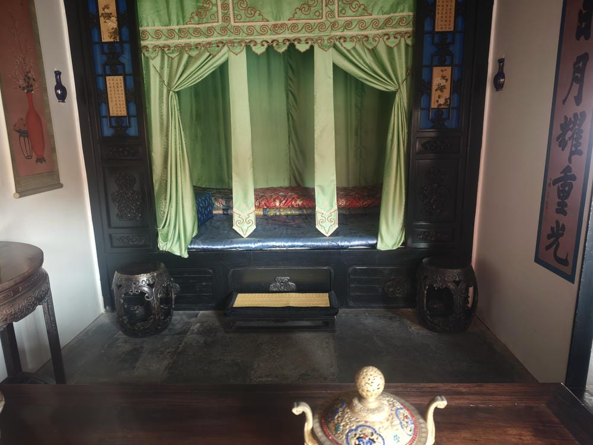

在看了太多宫殿，令我有些审美疲劳之后，突然看到一个”西洋建筑“还是眼前一亮的。这个没有完工的建筑是延禧宫，也被称作“水晶宫”。灰白色的石材和裸露的金属结构夹在红墙黄瓦之间，我想按照现在来看应该算是“烂尾楼”了吧。

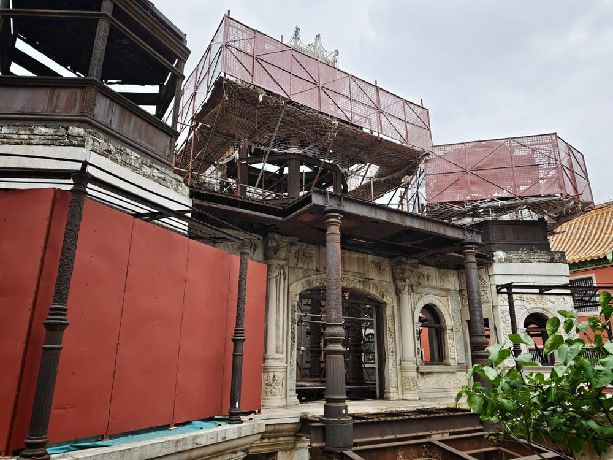

故宫有一些宫殿是可以走进去参观的，我和 hamel 特意走进去参观了几个。好像所有的古代木制建筑的内部，都会散发出一股难以形容的味道，不知道这种味道是不是所谓“时光”的味道。还有一点，几乎所有的建筑内部其实都很暗，远没有照片看起来这么亮，这一点应该是手机的相机刻意“美化”过了，所以才显得这么亮。所以古人以前电灯，条件还是挺艰苦啊。

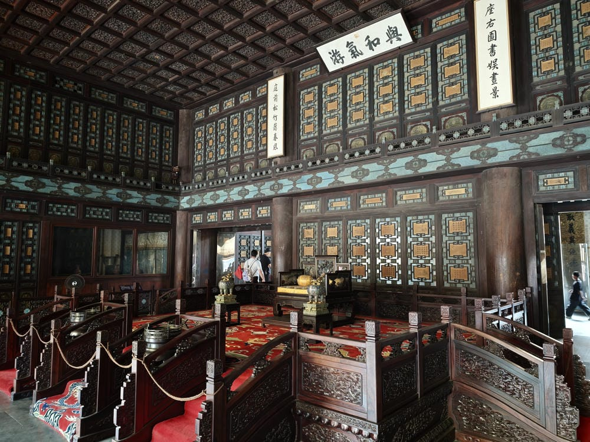

当我们故宫博物馆逛完了之后，已经快到4点了，已经几乎是要力竭了，按照既定计划是要再逛一下后面的景山公园的，但是 hamel 说有点不太想去，还好我给他灌输 "来都来了" 的经典旅行思想，他才勉强和我一起上景山公园。

景山公园上的人密度感觉比故宫更大，但是 hamel 找了一个非常好的取景地拍了照。

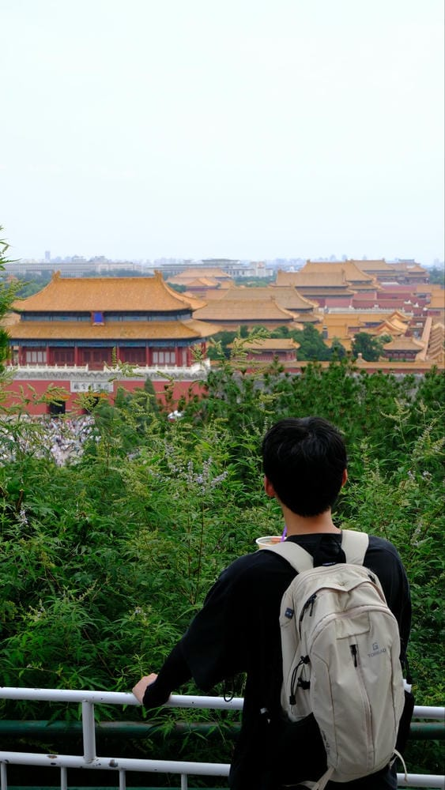

晚上我们去吃了四季民福，排了好长时间的队才吃上，烤鸭这一块确实很令我印象深刻，因为我平时也经常吃北京烤鸭的外卖，但是皮这么脆的，入口即化的确实是第一次吃到。

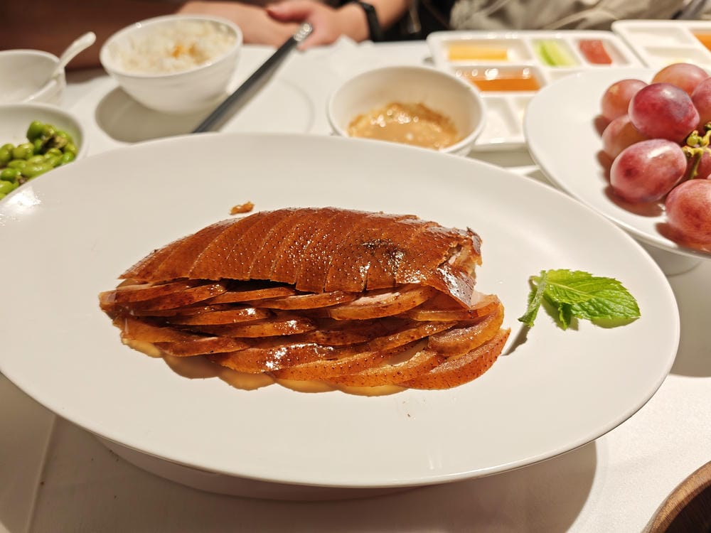

#### 📅 8-10

八达岭长城是离我们住的酒店最远的一个景区，为此还提前定了中午到八达岭长城站的高铁票，你问我为什么定的中午的票？因为我们之前没意识去八达岭长城的票得抢，等到我们买票的时候只剩中午和下午的高铁票，不过还好爬八达岭长城不需要一整天的时间，一个下午爬完，然后坐下午5点半的高铁回去就足够了。

我和 hamel 都做好了防晒准备，我穿上冰袖，渔夫帽，而 hamel 是穿了防晒服，因为今天一天几乎都需要在户外活动。

刚到长城的时候，第一时间我注意到的不是长城的宏伟，延绵不绝，而是城墙上被刻满了密密麻麻的字，到处都是某某某到此一游，或者直接是某个团队或某人的名字。我回想起以前看过的新闻，北京的长城以前是没有严格禁止游客在城墙上面刻字的，后面才抓得比较严，只要在城墙上刻字就会被请去”喝茶“了。

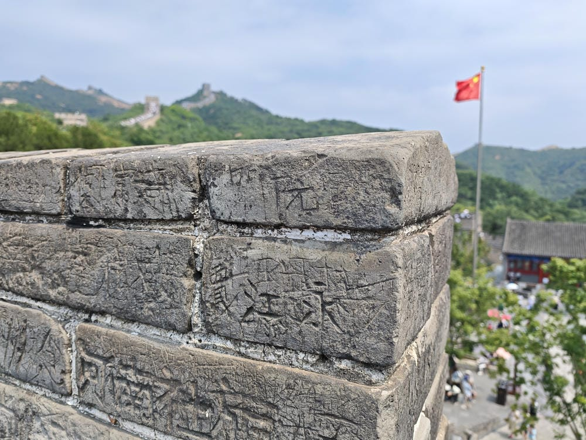

沿着八达岭长城的路走，我一直在观察城墙，几乎每一块砖都被已经被刻了字，很难找到几块干净的城墙。这些字大多数年份都在2010年以前，长城固然是历史遗迹，那这些由无数游客刻画，留下的文字，将来有一天会不会也成为所谓的历史的一部分，或者说它们已经是历史的一部分了。

这样想着，突然感觉路越来越陡了，因为难走，游客走的慢，然后大家就挤在一起，这下让我感觉到爬长城的艰辛了。

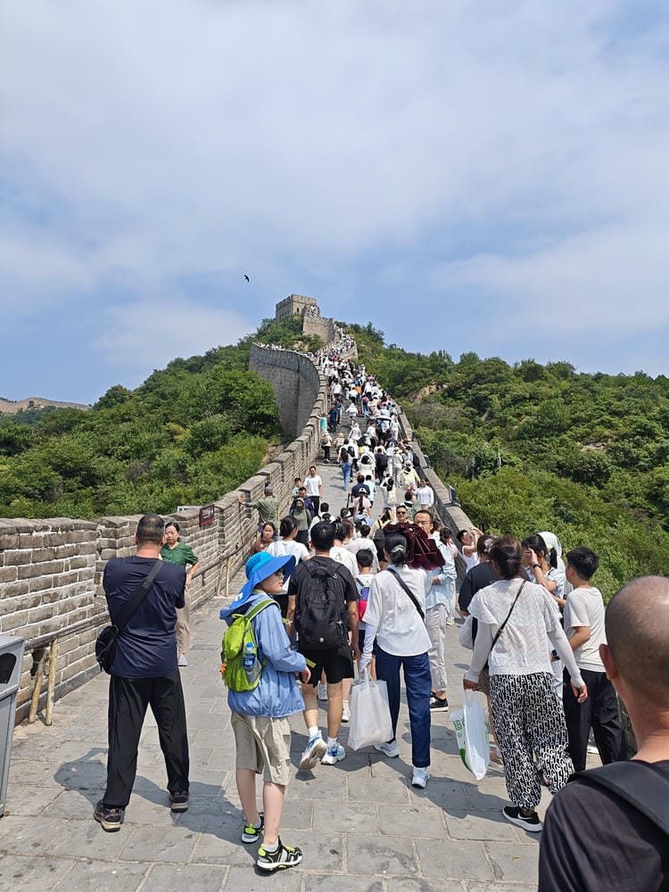

我们一路爬，爬升的时候很累，下行的时候也挺累，不过下行的时候人就很少了。最后我们到本次长城的终点北十二楼打了卡。

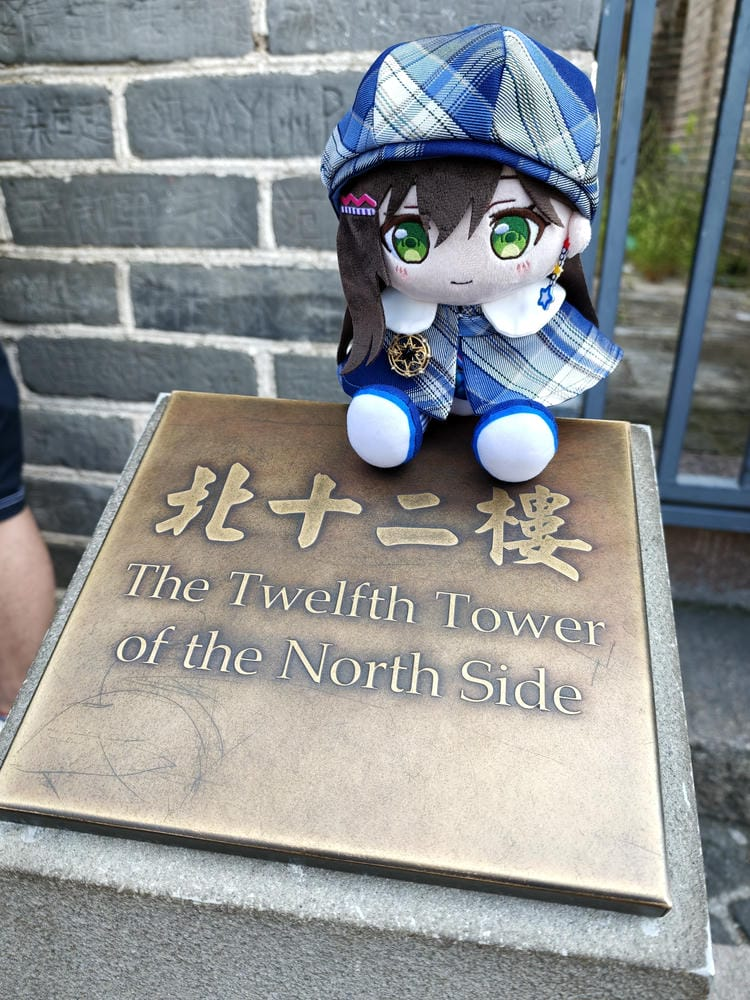

我们晚上去去了一个叫北平酒吧的地方吃饭，说实话我一开始没有抱很大期待，但是预料之外的不错，做的东西分量很大，而且那个位置很好，能看到鸟巢，可以享受北京的蓝调时刻。

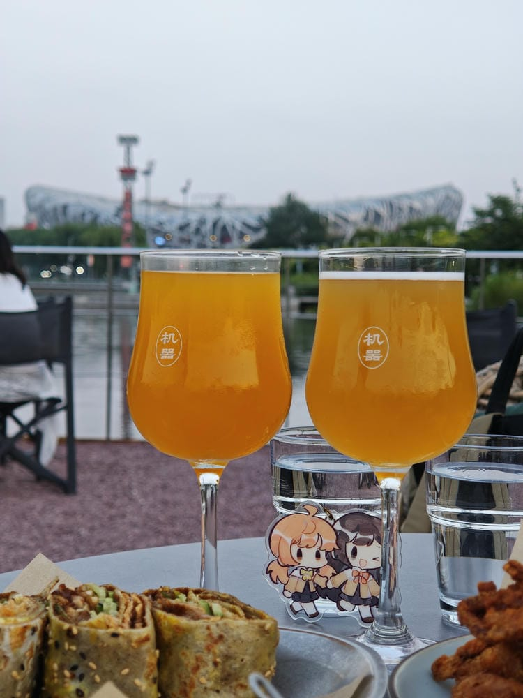

#### 📅 8-11

最后一天去了北京军事博物馆，哎，感觉有点不想写了，果然我还是不太擅长文字工作呐，就随性分享一些令我印象深刻的地方吧。

首先，我一开始预计我们一上午就能把军事博物馆，结果居然逛到快下午4点才结束，比我想象中要大。尤其是-1楼真的挺震撼的，全是坦克，装甲车，火炮，真家伙！

居然还有安丘比(少女与战车的角色)的眼车CV33。

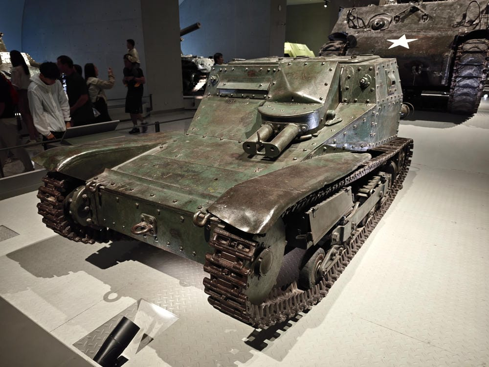

晚上我们去一家北京涮羊肉店吃，可惜那家挺一般的，羊肉只要一种比较好吃。

吃完去北京王府井逛了一下二次元商圈，体感是不如上海，但是有家店老板展示了很多CD，那家店感觉还挺不错的。

#### 📅 8-12

今天早上我们睡到很晚才起来，然后就坐高铁回去了。